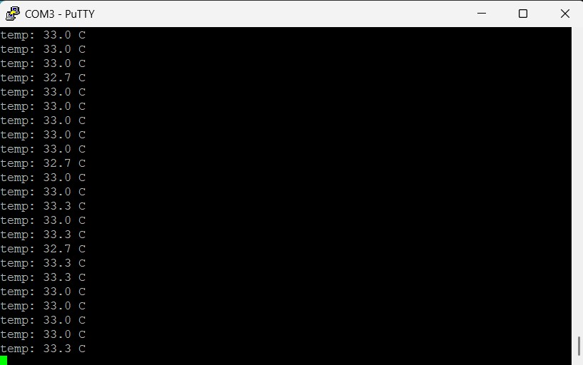
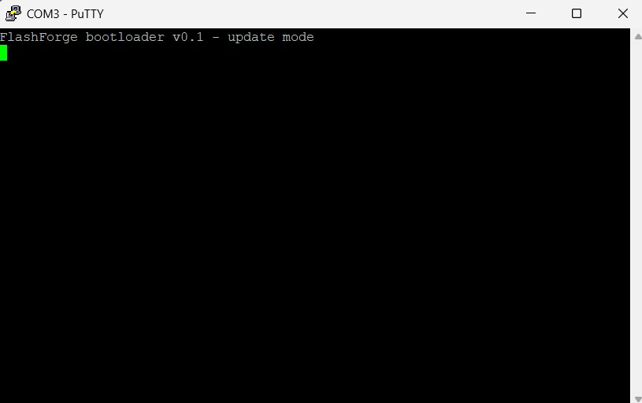

# FlashForge

A custom STM32 bootloader with over-the-air firmware update over UART, CRC-validated
images, and an interrupted-update failsafe — built from the reset vector up on a
Nucleo-F446RE.

> My dissertation deployed LoRa nodes on remote power-line poles, which raised a
> question: how do you update firmware on hardware you can't physically reach? So I
> built a complete field-update system — a custom bootloader that validates every
> image with CRC32, a framed UART protocol with retry, and a Python flashing tool.
> If an update is interrupted mid-transfer, the board detects the corrupt image and
> stays safely in the bootloader instead of bricking.

## What it does

- On reset, a **bootloader** in flash sectors 0-1 checks the application for a valid
  header (magic + length + CRC32).
- Valid image -> relocates the vector table (VTOR), sets the stack pointer, and jumps
  to the app.
- Invalid image, or the user button held -> stays resident in **update mode**, a
  framed UART command loop.
- A Python host tool streams new firmware in CRC-checked chunks; the bootloader erases
  and programs flash, ACKing each frame.
- **Failsafe:** if the transfer is interrupted, the header (written last) is never
  completed, so the board rejects the partial image on next boot and waits for a retry.

## Demo

The v1 app blinks an LED; a firmware update delivered over UART replaces it with a v2
app that reads the F446's internal temperature sensor and streams it over serial —
visible proof the update landed. Pinching the chip makes the reading rise.



If a flash is interrupted (e.g. the cable is unplugged mid-transfer), the board detects
the incomplete image on next boot and stays safely in update mode instead of running it:



A second flash then recovers the board fully — no debugger, no external programmer.

## Memory map (F446RE, 512 KB flash)

| Address     | Contents                                   |
|-------------|--------------------------------------------|
| 0x08000000  | Bootloader (sectors 0-1, 32 KB)            |
| 0x08008000  | App header: magic \| version \| length \| CRC32 |
| 0x08008200  | Application + vector table (512-aligned)    |

The bootloader's sectors are never written by the update path, so no interrupted
update can damage it — the board cannot be bricked.

## UART protocol

Frame format:

```
[0xA5] [LEN] [CMD] [PAYLOAD...] [CRC32]
```

- `0xA5` start-of-frame marker; `LEN` payload length; `CMD` command byte.
- CRC32 (CRC-32/MPEG-2) covers LEN + CMD + PAYLOAD. All multi-byte fields little-endian.
- Replies are single bytes: ACK (0x79) or NACK (0x1F). The host retries a NACKed or
  timed-out frame up to 3 times.

| Command | Code | Payload              | Action                          |
|---------|------|----------------------|---------------------------------|
| PING    | 0x01 | (none)               | Confirm the board is listening  |
| ERASE   | 0x02 | sector (1 byte)      | Erase one flash sector          |
| WRITE   | 0x03 | addr (4) + data      | Program words at an address     |
| GO      | 0x05 | (none)               | Reset and boot the application  |

A receive state machine (WAIT_SOF -> LEN -> CMD -> PAYLOAD -> CRC) with a mid-frame
timeout handles resynchronisation and abandoned frames.

## How it's built

- **Bootloader (C, register-level):** custom linker script, VTOR relocation, a
  register-level flash driver (unlock / sector erase / word program / readback verify)
  written from RM0390, the CRC peripheral, and the framed protocol.
- **App (C):** relocated to 0x08008200, blinks (v1) or reads the temp sensor (v2).
- **Host (`flashforge.py`):** builds validated images, streams them over UART with
  retry, and drives the full erase/write/go sequence.

See [BUILD.md](BUILD.md) to build and run, and [docs/notes.md](docs/notes.md) for the
engineering decisions behind each part.

## Design decisions (highlights)

- **Header written last** so an interrupted update never leaves a valid header in front
  of an incomplete app — the board rejects the partial image at the cheapest check.
- **512-byte vector-table alignment** (VTOR's low bits are hardwired zero), caught during
  design rather than as a runtime hardfault.
- **CRC algorithm specified before implementation** — the F446 hardware CRC is
  CRC-32/MPEG-2, not the reflected variant `zlib.crc32` computes; agreeing on the byte
  packing in the spec meant the board and host matched on the first try.
- **Reset-equivalent handover** — the jump clears pending interrupts and restores the
  interrupt-enable state so the application starts exactly as it would after a hardware
  reset.

## Hardware

ST Nucleo-F446RE and one USB cable. Nothing else required.

